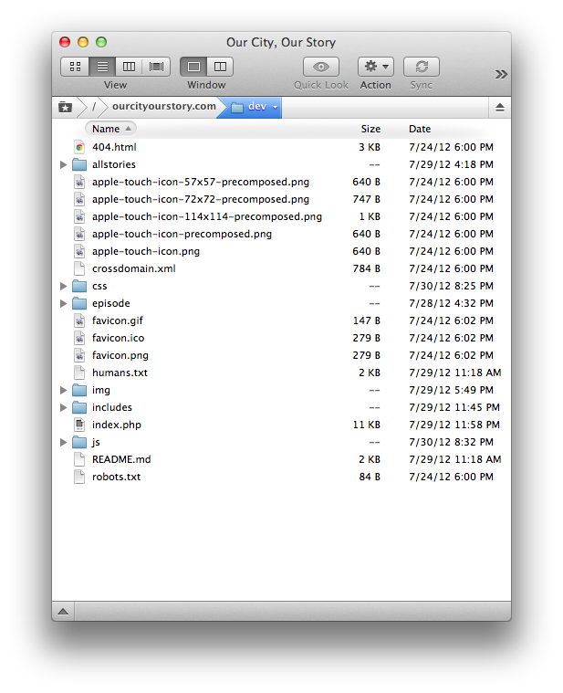
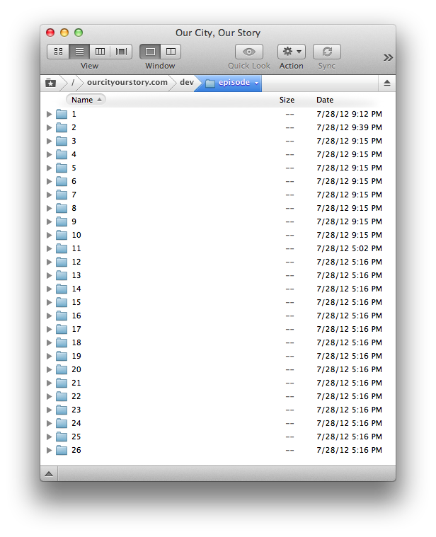

OurCitYourStory.com
===================

The static one-page solution for ourcityourstory.com.

Owned by Pablo Korona  
[@pablokorona](http://www.twitter.com/pablokorona)  
[pablokorona@gmail.com](mailto:pablokorona@gmail.com)

Designed by Jason James  
[@jas0njames](http://www.twitter.com/jas0njames)  
[jason@jasonjam.es](mailto:jason@jasonjam.es)

Coded by Jesse Atkinson  
[@jsatk](http://www.twitter.com/jsatk)  
[jesse.s.atkinson@gmail.com](mailto:jesse.s.atkinson@gmail.com)

Manual
======

Directory structure
------------------------

### `/` ###

`404.html` : Error page when user goes to a non-valid URL on the domain. Allows user to search [ourcityourstory.com](http://ourcityourstory.com) for what they were looking for.

`README.md` : This document that explains all details about the website.

`apple-touch-icon-114x114-precomposed.png` : Save webpage to home screen icon for iOS.

`apple-touch-icon-57x57-precomposed.png` : Save webpage to home screen icon for iOS.

`apple-touch-icon-72x72-precomposed.png` : Save webpage to home screen icon for iOS.

`apple-touch-icon-precomposed.png` : Save webpage to home screen icon for iOS.

`apple-touch-icon.png` : Save webpage to home screen icon for iOS.

`comps` : Jason's comps.

`crossdomain.xml` : Crossdomain policies.

`css` : Contains our styles.css which makes the site look pretty.

`episode` : Folder containing subfolders for the Episodes.

`favicon.gif` : Website's favicon.

`favicon.ico` : Website's favicon.

`favicon.png` : Website's favicon.

`humans.txt` : See [humanstxt.org](http://humanstxt.org). This contains credits and info about the humans behind this website.

`img` : Folder containing all of our images.

`includes` : Our PHP includes that allow us to change things in one place and have it populate accross all pages.

`index.php` : Homepage. This is what users see when they go to [ourcityourstory.com](http://ourcityourstory.com)

`js` : Contains our javascript, plugins, libraries, etc.

`robots.txt` : Used for search optimization so we're tracked correctly on search engines.

### `/episode/` ###

Here is where all of the episode pages live. If there is a need for more episodes simply duplicate the folder for the latest episode, rename the folder to the next episode number, and finally add it's index.php to Cushy CMS.